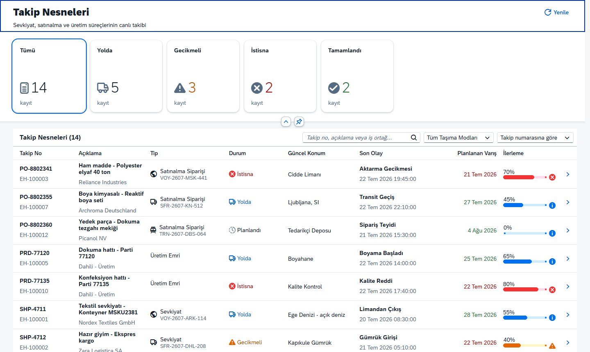
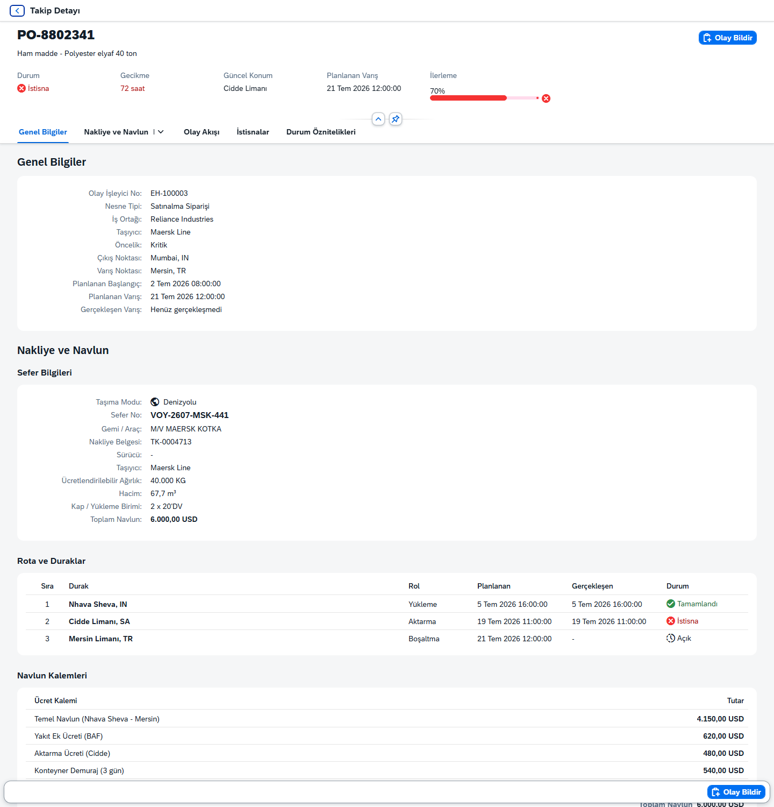
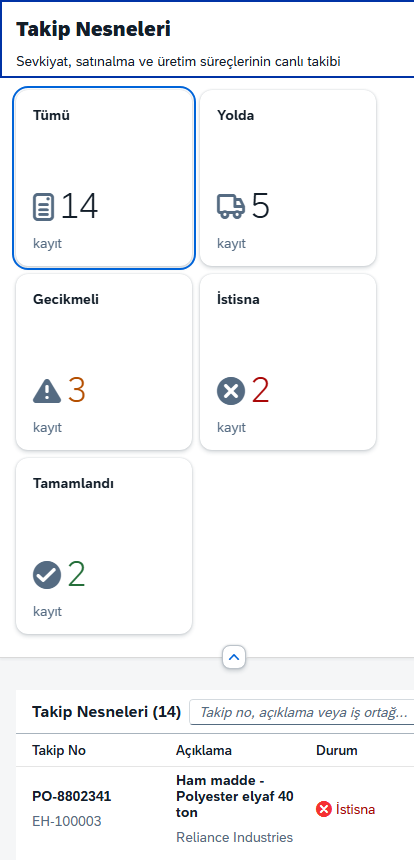

# SAP Event Management — Fiori Demo

SAP Event Management (EM) senaryosunun SAPUI5 / Fiori demo uygulaması. Sevkiyat,
satınalma ve üretim süreçlerini olay bazlı takip eder; nakliye seferlerini, rota
duraklarını ve navlun kalemlerini gösterir, kullanıcının yeni olay bildirmesine izin verir.

**Backend gerektirmez.** Tüm veriler `webapp/model/eventData.json` içindeki mock veri
modelinden okunur, dolayısıyla uygulama tamamen statik olarak yayınlanabilir.

> Veriler tamamen kurgusaldır ve yalnızca demo amaçlıdır.

---

## Ekran görüntüleri

### Takip nesneleri listesi
KPI kartları durum filtresi olarak çalışır; arama, taşıma modu filtresi ve sıralama üsttedir.



### Detay — nakliye ve navlun
Sefer bilgileri, rota durakları ve navlun ücret kalemleri.



### Mobil
Aynı ekran telefonda: kartlar iki sütuna, tablo sütunları popin'e düşer.



---

## Özellikler

**Liste ekranı**

- Durum bazlı KPI kartları (Tümü / Yolda / Gecikmeli / İstisna / Tamamlandı) — tıklayınca listeyi filtreler
- Takip no, açıklama, iş ortağı ve konum üzerinde serbest metin arama
- Taşıma moduna göre filtre (denizyolu, karayolu, havayolu, demiryolu)
- Takip no, durum, gecikme veya planlanan varışa göre sıralama
- Küçük ekranlarda sütunların popin'e düştüğü responsive tablo

**Detay ekranı**

| Bölüm | İçerik |
| --- | --- |
| Genel Bilgiler | Olay işleyici no, nesne tipi, iş ortağı, taşıyıcı, çıkış/varış, planlanan ve gerçekleşen zamanlar |
| Nakliye ve Navlun | Sefer no, gemi/araç, sürücü, nakliye belgesi, ağırlık/hacim/kap; rota durakları; navlun ücret kalemleri ve toplam |
| Olay Akışı | Gerçekleşen, beklenen, gecikmiş ve istisna olayların zaman çizelgesi |
| İstisnalar | Açık istisnalar ve önem derecesi |
| Durum Öznitelikleri | Sevkiyat belgesi, konteyner no, incoterm gibi alanlar |

**Olay bildirme**

Katalogdan olay kodu, zaman, konum ve açıklama girilir. Bildirilen olay zaman
çizelgesinde beklenen bir olayla eşleşiyorsa onu "gerçekleşti"ye çevirir; eşleşme yoksa
yeni satır eklenir. Ardından başlıktaki durum, ilerleme yüzdesi ve güncel konum yeniden
hesaplanır. `POD` (teslim onayı) kaydı tamamlar, `EXC` istisna açar.

---

## Teknik

| | |
| --- | --- |
| Çatı | SAPUI5 1.150.0 (freestyle), `sap_horizon` teması |
| Ana kontroller | `sap.f.DynamicPage`, `sap.uxap.ObjectPageLayout`, `sap.m.Table` |
| Model | `JSONModel` (mock veri) |
| Namespace | `com.alihaydarsayar.demo.zfiorieventmng` |
| Dil | Türkçe (`webapp/i18n/i18n.properties`) |
| Araçlar | UI5 Tooling 4, ESLint (`@sap-ux/eslint-plugin-fiori-tools`) |

### Proje yapısı

```
webapp/
├── controller/
│   ├── BaseController.js      router, model ve i18n yardımcıları
│   ├── Main.controller.js      filtreleme, arama, sıralama, KPI sayaçları
│   └── Detail.controller.js    detay binding'i ve olay bildirme mantığı
├── model/
│   ├── eventData.json          mock veri: 14 takip nesnesi + olay kodu kataloğu
│   └── formatter.js            durum/tarih/para birimi biçimlendiricileri
├── view/
│   ├── Main.view.xml           KPI kartları + takip nesneleri tablosu
│   ├── Detail.view.xml         Object Page ve bölümleri
│   └── fragment/
│       └── ReportEvent.fragment.xml
├── css/style.css               zaman çizelgesi ve KPI kartı stilleri
└── i18n/i18n.properties
```

### Veri modeli

`eventData.json` üç kök alandan oluşur:

- **`handlers`** — takip nesneleri. Her kayıt durum, ilerleme, gecikme ve konum
  bilgisinin yanında `events` (olay akışı), `exceptions`, `attributes` ve `freight`
  (sefer, rota, navlun kalemleri) alt nesnelerini taşır. Üretim emirlerinde
  `freight` alanı `null`'dır.
- **`eventCodes`** — bildirilebilecek olay kodları kataloğu.
- **`transportModes`** — taşıma modu filtresinin seçenekleri.

Gerçek bir OData servisine geçiş için `manifest.json` içindeki `em` modelinin
`sap.ui.model.json.JSONModel` yerine `sap.ui.model.odata.v2.ODataModel` (veya v4)
olarak tanımlanması ve binding yollarının entity set adlarına uyarlanması yeterlidir.

---

## Çalıştırma

Gereksinim: güncel Node.js LTS.

```bash
npm install
npm start            # Fiori Launchpad önizlemesiyle
npm run start-noflp  # doğrudan index.html
```

Diğer komutlar:

```bash
npm run lint         # ESLint
npm run build        # dist/ altına üretim derlemesi
npm run unit-test    # QUnit birim testleri
npm run int-test     # OPA5 entegrasyon testleri
```

UI5 çalışma zamanı `https://ui5.sap.com` üzerinden yüklenir; ilk açılışta internet
bağlantısı gerekir.

---

## Yayınlama

`main` dalına her push'ta [`.github/workflows/deploy-pages.yml`](.github/workflows/deploy-pages.yml)
iş akışı bağımlılıkları kurar, lint çalıştırır, `dist/` üretir ve GitHub Pages'e yayınlar.
İş akışı **Actions** sekmesinden elle de tetiklenebilir.

Etkinleştirmek için: **Settings → Pages → Build and deployment → Source: `GitHub Actions`**

> GitHub Pages private depolarda ücretli plan gerektirir. Depo public değilse ya
> görünürlüğü değiştirin ya da `dist/` klasörünü Netlify, Vercel veya Cloudflare Pages
> gibi bir statik barındırma servisine yükleyin.

---

## Bilinen sınırlar

- Bildirilen olaylar yalnızca tarayıcı belleğinde tutulur; sayfa yenilenince mock veri
  başlangıç durumuna döner.
- `manifest.json` içinde `flexEnabled` kapalıdır. Uygulama gerçek bir Launchpad'e alınıp
  key user adaptasyonu isteniyorsa bu ayar açılmalı ve tüm kontrollere stabil ID verilmelidir.
- Yalnızca Türkçe metin paketi vardır.

---

## Uygulama künyesi

| | |
| --- | --- |
| Üretim tarihi | 23.07.2026 |
| Şablon | SAP Fiori Application Generator 1.27.0 — Basic |
| Servis tipi | Yok (mock veri) |
| Modül adı | zfiorieventmng |
| Namespace | com.alihaydarsayar.demo |
| UI5 sürümü / tema | 1.150.0 / sap_horizon |
| TypeScript | Hayır |
